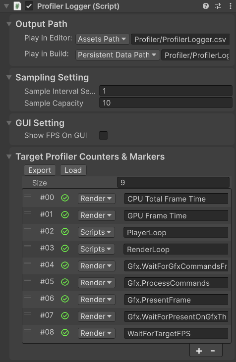

# Profiler Logger

A Unity package for logging Profiler Counters, Profiler Markers, and FPS to a CSV file.

# Installation

## Method 1: Local Package

> Suitable for developement purpose

1. Clone this git repository to anywhere you like
2. Window > Package Management > Package Manager > install package from disk

## Method 2: Install from git url

1. Window > Package Management > Package Manager > install package from git URL

## Method 3: Embed Package

> Suitable for developement purpose and git submodule

1. Directly clone this git repository into `Packages/` folder.

# Usage

1. Add the component `Profiler Logger` to any active object in the scene.
2. Adjust the settings
3. Play the game. It will start to log data when the `Start()` is executed, and save the log when the game quits.

# Settings

The following settings can be adjusted:

- Output Path: where to save the log
- The frequency of sampling
- Whether to show FPS on GUI
- The Profiler Counters and Profiler Markers that need to be logged
    - Export / Load the entire list to / from the CSV file
    - Enable / Disable each metrics separately
    - The `category` and `statName` parameters for each metrics that will be passed to `ProfilerRecorder.StartNew`
